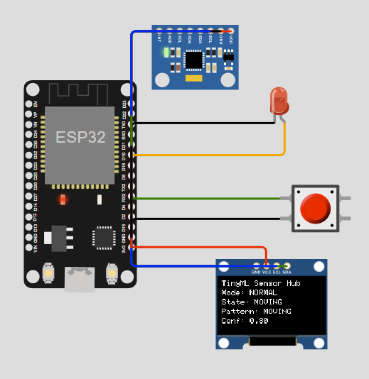
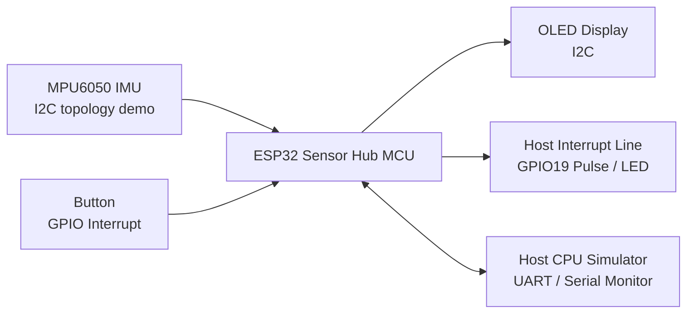
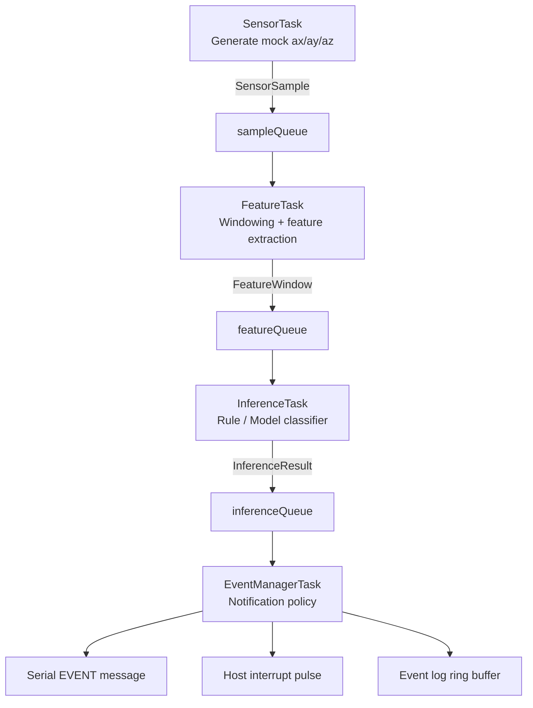
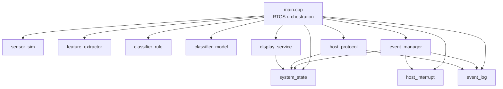
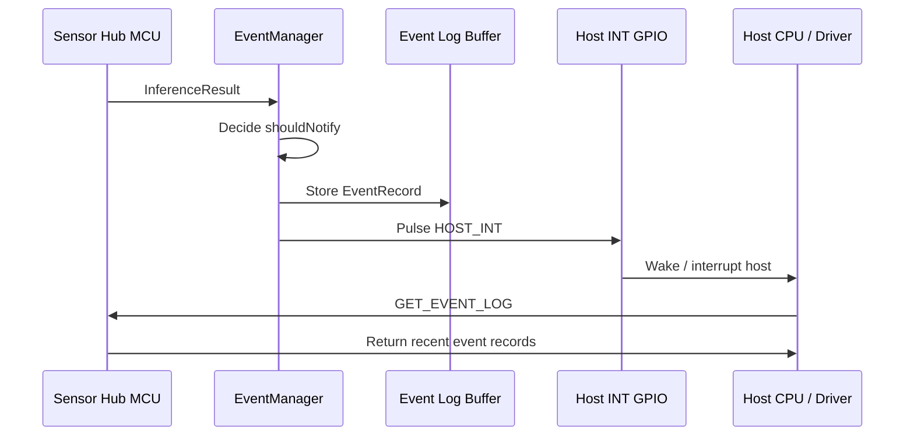
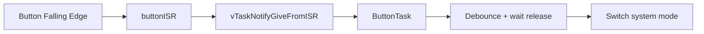

# TinyML Sensor Hub Simulator

A firmware-style sensor hub demo that simulates how a low-power MCU can process motion sensor data locally, run lightweight inference, and notify a host CPU only when meaningful events occur.

This project is designed as a **firmware engineering portfolio project**. It focuses on RTOS task design, queue-based data pipelines, ISR-to-task handoff, host communication, event logging, system health monitoring, and a lightweight inference backend suitable for a tiny system / sensor hub scenario.

---

## 1. Project Overview

The project simulates a mobile-device-style sensor hub:

- ESP32 acts as the **Sensor Hub MCU**.
- Serial Monitor acts as the **Host CPU / AP driver interface**.
- MPU6050 is included in the Wokwi diagram to show the intended IMU topology.
- OLED displays runtime status.
- Button switches system mode through a GPIO interrupt.
- LED simulates a **host interrupt line** asserted when the sensor hub has an event for the host.



> **Note on the MPU6050:** The Wokwi diagram includes an MPU6050 IMU to show the intended I2C sensor topology. The current demo uses a simulated sensor backend (`sensor_sim`) to generate motion patterns such as `STILL`, `MOVING`, `SHAKING`, and `IMPACT`. This is intentional because the simulator IMU does not provide realistic phone-like dynamic motion interaction. The firmware is structured so the simulated backend can later be replaced by a real I2C IMU driver without changing the feature extraction, inference, or event manager pipeline.

---

## 2. Motivation

In a phone-like architecture, the main ARM application processor is powerful but relatively power hungry. Many sensing tasks do not require the main CPU to stay awake continuously.

A sensor hub can:

- continuously process low-rate or always-on sensor data,
- convert raw samples into higher-level events,
- suppress unimportant repeated states,
- notify the host only when necessary,
- reduce host CPU wakeups and improve power efficiency.

This project demonstrates that concept using a simulated RTOS-based firmware pipeline.

---

## 3. System Overview



The host can send commands through Serial, while the sensor hub reports meaningful motion events and pulses the host interrupt line.

---

## 4. RTOS Data Pipeline



The important design idea is that raw sensor samples are processed locally inside the sensor hub. The host CPU only receives high-level events.

---

## 5. Firmware Module Architecture



### Module responsibilities

| Module | Responsibility |
|---|---|
| `app_config` | Project-level config: pins, queue sizes, sampling periods, task priorities |
| `app_types` | Shared enums, structs, string helpers, parser helpers |
| `system_state` | Shared runtime state with mutex-protected access |
| `sensor_sim` | Mock accelerometer backend generating `ax/ay/az` samples |
| `feature_extractor` | Converts raw sample windows into compact statistical features |
| `classifier_rule` | Rule-based baseline classifier |
| `classifier_model` | Lightweight prototype-model classifier, if enabled |
| `event_manager` | Decides whether an inference result should notify the host |
| `event_log` | Fixed-size event ring buffer for recent host notifications |
| `host_interrupt` | GPIO pulse simulating host CPU interrupt / wakeup |
| `host_protocol` | UART/Serial command parsing and host responses |
| `display_service` | OLED initialization and display updates |
| `main.cpp` | RTOS queue creation, task orchestration, ISR setup, module initialization |

---

## 6. Host Notification Model



When the EventManager decides an event should be reported, it first stores detailed event context in the event log, then asserts the simulated host interrupt line. This models a common sensor hub pattern where the host CPU is interrupted and later reads event details from a mailbox, FIFO, or driver-facing buffer.

---

## 7. Motion Patterns

The current demo uses simulated accelerometer data.

| Pattern | Meaning | Simulated behavior |
|---|---|---|
| `STILL` | Phone is stationary | `az ≈ 1g`, small noise |
| `MOVING` | General motion | Moderate periodic acceleration changes |
| `SHAKING` | Strong shaking | High variance and high energy signal |
| `IMPACT` | Impact / drop-like event | Mostly still, with periodic acceleration spikes |

The host can change the simulated pattern:

```text
SET_PATTERN STILL
SET_PATTERN MOVING
SET_PATTERN SHAKING
SET_PATTERN IMPACT
```

---

## 8. Feature Extraction

The firmware collects a window of raw samples and computes compact features:

- `meanX`, `meanY`, `meanZ`
- `varX`, `varY`, `varZ`
- `energy`
- `maxAbs`

In normal mode:

```text
50 Hz sampling
50 samples per feature window
≈ 1 inference per second
```

In low-power mode:

```text
10 Hz sampling
50 samples per feature window
≈ 1 inference every 5 seconds
```

---

## 9. Inference Backends

The project supports an inference abstraction so the pipeline does not depend on a single classifier implementation.

### Rule-based classifier

The rule-based classifier uses explicit thresholds:

```text
maxAbs high        -> IMPACT
energy/variance high -> SHAKING
variance medium   -> MOVING
otherwise         -> STILL
```

### Model-based classifier

The model-based classifier is intentionally lightweight. It uses hand-calibrated class prototypes stored as constant arrays and compares normalized feature vectors against these prototypes.

This is not a trained neural network. It is a small model-based inference backend intended to demonstrate how sensor hub firmware can switch between inference implementations without changing the RTOS pipeline.

Commands:

```text
SET_CLASSIFIER RULE
SET_CLASSIFIER MODEL
```

---

## 10. System Modes

| Mode | Behavior |
|---|---|
| `NORMAL` | 50 Hz sampling, event-based host notification |
| `DEBUG` | 50 Hz sampling, prints every inference result |
| `LOW_POWER` | 10 Hz sampling, lower sensing/inference frequency |

The physical button cycles modes:

```text
NORMAL -> DEBUG -> LOW_POWER -> NORMAL
```

The button uses GPIO interrupt + task notification:



---

## 11. Host Commands

Supported Serial commands:

```text
HELP
GET_STATUS
GET_STATS
GET_HEALTH
GET_EVENT_LOG
CLEAR_EVENT_LOG
DUMP_FEATURE
RESET_STATS
SET_MODE NORMAL
SET_MODE DEBUG
SET_MODE LOW_POWER
SET_CLASSIFIER RULE
SET_CLASSIFIER MODEL
SET_PATTERN STILL
SET_PATTERN MOVING
SET_PATTERN SHAKING
SET_PATTERN IMPACT
```

### Example: status

```text
GET_STATUS
```

Example output:

```text
===== STATUS =====
Mode: NORMAL
Classifier: RULE
Sensor Pattern: MOVING
Motion State: MOVING
Confidence: 0.800
Energy: 1.063
Max Abs: 1.201
==================
```

### Example: stats

```text
GET_STATS
```

Example output:

```text
===== STATS =====
Samples generated: 1954
Features computed: 39
Inferences run: 39
Host notifications: 8
Suppressed notifications: 31
Sample queue drops: 0
Notify/sample ratio: 0.409%
Estimated wakeup reduction: 99.591%
=================
```

### Example: health

```text
GET_HEALTH
```

Reports runtime diagnostics such as uptime, free heap, pipeline activity, last inference age, and queue drops.

### Example: event log

```text
GET_EVENT_LOG
```

Shows recently reported host events stored in the sensor hub ring buffer.

---

## 12. Event Log Ring Buffer

The event log stores recent host notification events. A record includes:

- timestamp
- previous motion state
- new motion state
- confidence
- energy
- maximum acceleration magnitude
- notification reason

Example:

```text
===== EVENT LOG =====
count=4 size=10
[0] t=1020 reason=FIRST_RESULT STILL->STILL conf=0.90 energy=1.00 max=1.02
[1] t=5240 reason=STATE_CHANGE STILL->MOVING conf=0.80 energy=1.05 max=1.22
[2] t=8300 reason=STATE_CHANGE MOVING->SHAKING conf=0.88 energy=1.74 max=2.07
[3] t=10420 reason=STATE_CHANGE SHAKING->IMPACT conf=0.95 energy=2.13 max=4.26
=====================
```

The buffer is fixed-size and overwrites the oldest record when full. It does not use dynamic allocation.

---

## 13. Demo Script

A simple demo sequence:

```text
GET_STATUS
GET_HEALTH
CLEAR_EVENT_LOG
SET_PATTERN MOVING
DUMP_FEATURE
SET_PATTERN SHAKING
SET_PATTERN IMPACT
GET_STATS
GET_EVENT_LOG
SET_MODE DEBUG
SET_PATTERN STILL
```

Expected behavior:

- OLED updates the current mode and motion state.
- Serial prints event notifications when motion state changes.
- Host interrupt LED pulses when the sensor hub reports an event.
- `GET_STATS` shows that host notifications are much fewer than raw samples.
- `GET_EVENT_LOG` shows the recent host notification history.

---

## 14. Current Limitations

- The MPU6050 in the Wokwi diagram is currently a hardware topology demo.
- Raw motion samples are generated by `sensor_sim`, not read from the MPU6050.
- The model-based classifier is a lightweight hand-calibrated prototype model, not a trained neural network.
- Host communication currently uses text commands over Serial for demo readability.
- The host CPU / OS driver is simulated by the Serial Monitor.

---

## 15. Future Work

Potential extensions:

- Replace `sensor_sim` with a real I2C IMU driver.
- Train a tiny model and replace the prototype classifier.
- Add event cooldown / rate limiting for repeated high-priority events.
- Add binary host packet protocol with CRC.
- Add register-map style host access.
- Add sensor calibration and offset compensation.
- Add watchdog or task heartbeat monitoring.

---

